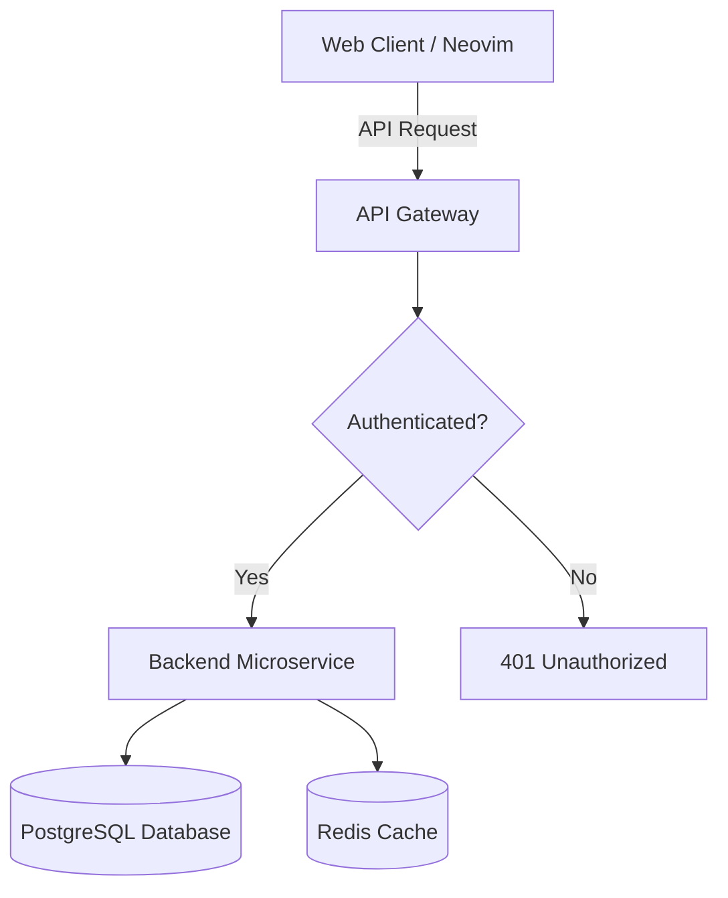
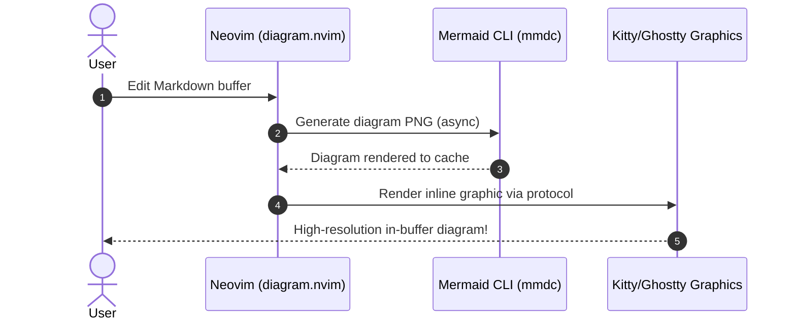

# Markdown & Mermaid Diagram Demo

This file demonstrates in-buffer rich markdown styling and Mermaid diagram rendering.

## 1. Flowchart Example

## 2. Sequence Diagram Example

## 3. Keybindings Quick Reference

- `<leader>mr`: Toggle rich markdown styling (`render-markdown.nvim`)
- `<leader>md`: Open rendered diagram at cursor in a dedicated tab/popup
- `<leader>mD`: Force refresh / re-render in-buffer diagrams
- `<leader>mc`: Clear rendered in-buffer diagram graphics
- `<leader>mp`: Toggle live browser preview (`markdown-preview.nvim`)
